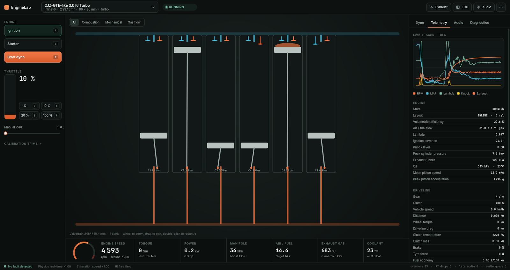

# EngineLab

[](https://github.com/zolaski333/EngineLab/actions/workflows/ci.yml)
[](https://github.com/zolaski333/EngineLab/releases)
[](LICENSE.md)


**A four-stroke engine simulator whose sound comes from the simulated gas
dynamics, not from samples.** Written in C++20 with JUCE.

EngineLab simulates an engine cycle by cycle — induction, combustion, exhaust —
and makes that simulation *audible*: the exhaust sound is the pressure actually
computed at the valves, propagated through a quasi-1-D duct network out to the
tailpipe and radiated to a pair of virtual microphones.

Design an engine, draw its exhaust system, put it on the dyno, listen to it.



> **Project status: early.** The physics, tooling and real-time pipeline are
> solid and heavily tested. The sound is not there yet: in blind listening
> against real recordings, engines are recognisable by their cylinder count and
> firing rhythm, but not yet as a specific engine. Closing that gap, starting
> with the Yamaha CP2 (MT-07), is the current milestone — see
> [VISION.md](VISION.md).

---

## Download

**Windows 10/11 x64:** grab `EngineLab-<version>-win64.zip` from the
[latest release](https://github.com/zolaski333/EngineLab/releases), extract it
anywhere and run `EngineLab.exe`. No installer and no separate runtime are
needed.

The executable is not code-signed, so Windows SmartScreen may warn about an
unknown publisher: choose **More info → Run anyway**. Every release archive is
built by GitHub Actions from the tagged commit and comes with a SHA-256
checksum.

Then:

1. pick an engine in the selector at the top of the window;
2. hold `A` to switch the ignition on, then hold `S` to crank;
3. throttle with `Q` (1 %), `W` (10 %), `E` (20 %) and `R` (100 %);
4. press `D` for an automatic dyno run, `Tab` to cycle the side panel
   (dyno, telemetry, audio, diagnostics).

Large engines (V8, V12) can fall below real time on a modest CPU; the realtime
factor is shown in the diagnostics.

---

## What EngineLab does

### Physics

- **Control-volume gas network** coupled to slider-crank kinematics, injection,
  flame propagation, torque derived from cylinder pressure, friction and pumping
  losses, turbocharging, and the driveline all the way to the vehicle.
- **Conservative quasi-1-D intake and exhaust**: every duct is meshed and
  solved, with signed SI mass flow at the valves, characteristic waveguides, a
  thermal wall model, and a passive radiation load at the outlet.
- **Physical exhaust elements**: primaries, collectors, junctions, X-pipes,
  resonators, expansion chambers (Munjal), porous packing (Delany-Bazley),
  catalysts and multiple outlets.
- **Emergent cycle-to-cycle variability**: the coupling between gas dynamics,
  fuel film, wave action and the ECU makes consecutive cycles genuinely
  different, with no authored random dispersion.
- **Exhaust afterfire** fed by unburned fuel on overrun and ignited by the pipe
  wall — which has to heat up first, as on a real engine.
- **Vehicle dynamics**: gearbox, stick/slip clutch, and longitudinal load
  transfer driven by wheelbase, centre-of-gravity height and driven axle.

### Audio

- **The exhaust path is driven entirely by simulated pressure.** No preset,
  noise source or blowdown oscillator is mixed into that physical path.
- Separate, individually soloable layers for intake, structure, the starter and
  forced induction (compressor, turbine, wastegate, dump valve).
- **Structural NVH modes** of the head and block, estimated per engine family or
  configured from measured, sourced data.
- The real-time audio callback performs **no allocation, no locking and no file
  access**; physics telemetry crosses lock-free SPSC queues.
- **Declarative, hot-reloadable voicing** (`voicing/*.yaml`): the mix is data,
  not code.

### Tooling

- **A 3-D engine view rendered on the GPU** (OpenGL 3.2): pistons, rods, crank
  throws, valves and flames placed by the simulator's own kinematics, so
  4,000 rpm on the tachometer is 4,000 rpm on screen. X-ray or solid block,
  layers (all, combustion, mechanical, gas flow), front / side / three-quarter
  views, a 0.25x or 0.5x simulation speed (the sound slows too) and a 1:50 or
  1:250 stroboscope (the picture only), motion blur and a frame-rate cap from 30
  fps to unlimited. The exhaust and intake are laid out from the engine's own
  configuration — the component graph with its real lengths, diameters and
  volumes (4-2-1, X-pipe, twin mufflers…), runners, plenum, throttle bores,
  airbox and inlet duct — and an *Exhaust* view frames the whole system. A
  2-D cutaway remains for machines without OpenGL 3.2.
- **A catalogue of 16 engines** — naturally aspirated and turbocharged I4s, a
  V8, a flat-six, a supercharged V12, motorcycle twins and triples, an inline
  five, a TDI diesel, a five-cylinder radial — all in readable, editable YAML.
- **Exhaust designer**, a validated graph editor for exhaust systems: it rejects
  cycles, incomplete branches and inconsistent cardinalities, and reports the
  solver cost of an unusual geometry before applying it.
- **ECU tuner**: AFR and spark tables plus the rev limiter, applied live through
  a transactional snapshot — the engine keeps running and keeps its thermal
  state.
- **`.els` DSL**, declarative and unit-typed, hot-reloaded on save; an invalid
  save keeps the last valid configuration running and shows the diagnostics.
- **Audio workshop**: mute/solo, JSON scenarios, and WAV export at 48/96/192 kHz in
  24-bit PCM or 32-bit float, with optional stems.
- **Automatic dyno**, stepped or as a continuous ramp, with history, curves and
  CSV export.

---

## Building from source

Prerequisites: Windows, Visual Studio 2022 with the *Desktop development with
C++* workload, CMake 3.24 or newer, and Git. JUCE, nlohmann/json and yaml-cpp
are fetched by CMake at pinned versions.

```powershell
git clone https://github.com/zolaski333/EngineLab.git
cd EngineLab
cmake --preset windows-vs2022
cmake --build --preset windows-release
```

The application lands in
`out/build/windows-vs2022/src/app/EngineLabApp_artefacts/Release/EngineLab.exe`.

Run the test suite and build the release archive:

```powershell
ctest --preset windows-release
cmake --build out/build/windows-vs2022 --config Release --target package
```

The project builds with warnings as errors. Details on the tests, the
deterministic harnesses and sanitizer builds are in
[docs/tests-and-validation.md](docs/tests-and-validation.md).

---

## Controls

Key bindings can be changed from **Key bindings…** in the `⋯` menu; `keybindings.json`
rejects unknown actions, duplicates and reserved shortcuts.

| Input | Default action |
|---|---|
| hold `A` / `S` | ignition / starter |
| `Q`, `W`, `E`, `R` | throttle 1 %, 10 %, 20 %, 100 % |
| `D` / `H` | automatic dyno / hold engine speed |
| `P` / `Tab` | pause / next side-panel tab |
| `M` / `,` | next / previous engine view layer |
| `1` to `5` | time scale 0.25×, 0.5×, 1×, 2×, 4× |
| up / down / left arrow | upshift, downshift, wheel brake |
| hold `Y` or `Shift` | declutch; `T` / `U` adjust the setpoint |
| `;` | next exhaust acoustic preset |
| wheel / drag / right-drag | zoom, orbit and pan the 3-D engine view |
| double-click | back to the selected camera view |

Holding `G`, `Z`, `X`, `C`, `V`, `B`, `J`, `K`, `L`, `O`, `N` or `Space` while
scrolling adjusts, respectively, the speed hold, volume, convolution, noise
bands, mix layers, simulation speed and fine throttle.

---

## Building and modifying an engine

Three levels are deliberately kept separate, from the most structural to the
lightest:

1. **JSON / YAML** describes the whole engine. Applying it replaces the
   simulation instance and resets its dynamic state.
2. **An `.els` script** picks a preset or a base file, then applies unit-typed
   changes. The application watches the file and hot-reloads it.
3. **The ECU tuner** publishes a calibration without replacing the runtime: a
   validated cell reaches the ECU on its next evaluation, with the engine still
   running.

An ECU change keeps the engine, its speed and its thermal state; changing
displacement, topology or geometry requires a new instance and starts from the
initial state. Reloads from the live script, the JSON editor and the exhaust
designer reuse the same ECU store, so the maps and the tuner window stay
active.

The **Exhaust designer** works on a copy of the engine: generate a starting
network, add and configure its components, connect the nodes, assign every
cylinder and **VALIDATE AND APPLY** (refused during a dyno run). **Export
engine…** in the `⋯` menu then saves the engine to JSON or YAML.

Two example scripts are ready to import: `examples/street-turbo.els` and
`examples/physical-audio-lab.els`.

---

## Measure, don't guess

EngineLab ships deterministic harnesses used as instruments, not only as
regression tests: each makes a physical quantity observable and comparable
against the literature or a real recording.

| Harness | What it measures |
|---|---|
| `AudioRenderHarness` | renders the real real-time path offline: RMS, crest, DC, per-band spectral balance, exhaust-chain RT60 |
| `GeometrySensitivityHarness` | does changing the exhaust change the sound? — timbre per third octave, one factor at a time |
| `AbClipRenderer` | loudness-matched blind A/B clips against real recordings or another engine |
| `RealtimeBudgetHarness` | realtime factor: simulated seconds per wall-clock second, on the real runtime thread |
| `CombustionPhasingTests` | LPP, CA10-50-90 and IMEP across an rpm sweep |
| `PhysicsPerfHarness` | gas-exchange trace at crank-degree resolution, on both sides of the valve |
| `CyclicVariabilityHarness` | COV(IMEP) per cylinder, at held engine speed |
| `DynoSweepHarness` / `UserDynoHarness` | torque and power curves, CSV export |
| `AfterfireHarness` | the shape of overrun heat release, and its real effect on the audio |
| `IntakeDuctBench` | bit-exact fingerprint of the duct solver: proves an optimisation is not a physics change |
| `SceneExport` | the 3-D scene of catalogue engines as JSON (meshes, duct centrelines and radii, ports, engine solids, route check issues), to inspect the laid-out ducts outside the app; prints the issue counts per engine |

Reference figures come from engine and acoustics literature or from real
recordings, never from the simulator's own output.

---

## Documentation

The [documentation index](docs/README.md) lists every guide. The main entry
points:

- [VISION.md](VISION.md) — what EngineLab is for and how success is judged;
- [Architecture](docs/architecture.md) and
  [simulation model](docs/simulation-model.md);
- [Physical thermoacoustic architecture](docs/thermoacoustic-architecture.md);
- [Custom exhaust systems](docs/custom-exhaust.md),
  [the `.els` DSL](docs/engine-scripting.md) and
  [the ECU tuner](docs/ecu-tuning.md);
- [Measurement journal](docs/journal.md) — current results, short entries;
- [CHANGELOG.md](CHANGELOG.md).

Working on the code with an AI agent? [.claude/CLAUDE.md](.claude/CLAUDE.md)
holds the working rules, build notes and verified traps of this repository.

---

## Known limitations

- four-stroke only; petrol and direct-injection diesel rely on global,
  semi-empirical combustion models;
- 0-D cylinder chambers and low-band quasi-1-D networks — this is not 3-D CFD;
- audible propagation is linear and plane: transverse modes, 3-D bends and the
  mean-flow correction of radiation are not resolved;
- at most eight audio exhaust paths and 32 cylinders;
- the exhaust designer has no drag-and-drop, no undo/redo and no IR picker —
  the IR stays editable in JSON/YAML;
- structural modes stay estimated per engine family until sourced measurements
  are supplied;
- the 3-D view lays the exhaust and intake out automatically: lengths,
  diameters and volumes are the configured ones, but the routing is invented
  (a pipe that must span more than its length is drawn longer), and the
  pressure waves shown on it are the real-time gas solver's, whose cells are
  about 0.36 m long (see
  [the architecture document](docs/architecture.md#gas-field-on-the-ducts));
- Windows only for now: the code is standard C++20 and JUCE, but no other
  platform is built or tested;
- large engines (V8, V12) are expensive for the physics thread; the application
  shows its realtime factor so that cost is visible.

---

## Contributing

Contributions are welcome — see [CONTRIBUTING.md](CONTRIBUTING.md) and the
[code of conduct](CODE_OF_CONDUCT.md). Two rules matter most:

- the project builds with **zero warnings**, and a green PR means a full green
  `ctest`;
- measurement beats code reading: if a change touches physics or audio, include
  the output of the matching harness, before and after.

---

## Acknowledgements

EngineLab owes its existence to
**[Engine Sim](https://github.com/ange-yaghi/engine-sim)** by **AngeTheGreat**
(Ange Yaghi): that project showed that a simulated engine could be *heard*, and
it is the direct inspiration for this one. The exhaust impulse responses in
`assets/ir/` come from it under the MIT license (© 2022 Ange Yaghi); see
[assets/ir/README.md](assets/ir/README.md).

The real recordings used for A/B listening are CC0 field recordings, credited
in [references/real-engine-audio/manifest.json](references/real-engine-audio/manifest.json).

Built with [JUCE](https://juce.com/),
[nlohmann/json](https://github.com/nlohmann/json) and
[yaml-cpp](https://github.com/jbeder/yaml-cpp).

---

## License

EngineLab's source code is released under the MIT license — see
[LICENSE.md](LICENSE.md). The prebuilt binaries also contain third-party code
under its own terms, notably JUCE; see
[THIRD_PARTY_NOTICES.md](THIRD_PARTY_NOTICES.md).
