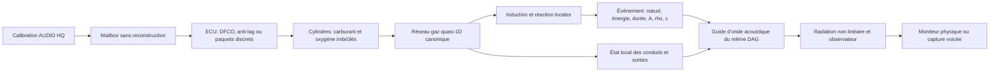

# Refonte audio, afterfire et échappement — 12 août 2026

## Verdict

Le défaut n’était pas une mauvaise valeur de gain isolée. Trois architectures
se superposaient sans partager la même vérité : l’ECU et la chimie produisaient
une énergie surtout continue, le réseau audio n’acceptait des sources qu’aux
cylindres, et plusieurs outils/UI modifiaient une géométrie scalaire déjà
éclipsée par un graphe explicite. Le son pouvait donc changer à peine, ou pour
une raison différente de celle affichée.

La correction fait désormais circuler une même topologie canonique dans le gaz,
l’acoustique, l’éditeur et l’export. Une combustion d’échappement publie une
source au nœud exact où elle a eu lieu. Les tests A/B montrent maintenant une
forte identité de topologie :

- Hayabusa 4-2-1 contre quatre tubes indépendants : **+5,23 dB** et **4,77 dB**
  de changement de forme spectrale dans le mix ;
- LS3 avec X-pipe contre deux 4-en-1 séparés : **5,39 dB** de changement de
  forme dans le mix, **8,50 dB** sur l’échappement seul ;
- LS3 complet contre huit tubes indépendants : **+0,46 dB** et **8,25 dB**
  de forme ;
- afterfire chaud, même Twin et même scénario : zéro réaction en DFCO propre,
  contre 10 impulsions irrégulières, 37,477 mg et 8,694 kW crête en stratégie
  discrète.

Ce résultat est une amélioration physique et instrumentale vérifiée. Ce n’est
pas encore une promesse qu’un LS3 simulé est indiscernable d’un enregistrement :
les limites restantes sont explicitées plus bas.

## Flux produit après correction

Le chemin ne contient aucun sample de pop et aucun oscillateur d’échappement.
Les seules excitations sont les pressions cylindres, les conditions aux limites
du réseau, le débit de jet sortant et la chaleur réellement libérée.

## Causes racines trouvées

### Afterfire

1. Le toggle pouvait être actif avec `overrun_fuel_fraction = 0` : l’interface
   annonçait la fonction, mais l’ECU ne livrait aucune matière.
2. `APPLY` reconstruisait `EngineRuntime`. Les parois et inventaires revenaient
   à l’ambiante au moment précis où une ligne chaude était nécessaire.
3. Le mode unique confondait DFCO propre, anti-lag continu et pops discrets.
4. Un hachage à 35 % de duty ne compensait pas la masse : il retirait 65 % de
   l’énergie moyenne par rapport au cas continu.
5. La réaction était un premier ordre sans délai d’induction, sans état de
   flamme persistant et sans fenêtre locale de flammabilité.
6. Le renderer acoustique ne recevait que des sources aux cylindres. Une
   réaction dans un collecteur ou un silencieux ne pouvait pas devenir une
   excitation localisée du graphe.
7. Une fraction moyenne de 12 % avec 35 % de duty donnait `phi ≈ 0,34`, sous la
   nouvelle limite pauvre `phi = 0,45`. Le zéro mesuré était alors correct mais
   la calibration de démonstration ne l’était pas.
8. Même après avoir rendu la chimie impulsive, l’ECU ouvrait encore les paquets
   sur un carré strict à 4 Hz. Le moteur pouvait donc reproduire la cadence
   « aigu → grave » parfaitement régulière signalée par l’utilisateur.

### Graphe et son d’échappement

1. Une `exhaust_path` avec `network` masque ses anciens champs scalaires. Les
   anciens A/B changeaient souvent `primary_length_mm` ou le silencieux sans
   modifier le réseau réellement simulé.
2. Plusieurs presets catalogue étaient recompilés différemment par les
   consommateurs. Le gaz, l’audio et l’éditeur ne garantissaient pas la même
   topologie.
3. Le LS3 possédait historiquement deux chemins par banque : un X-pipe nommé
   dans le preset, mais aucune connexion physique capable de transmettre une
   onde entre les banques.
4. Le 4-2-1 associait des cylindres adjacents. Les paires physiques 1+4 et 2+3
   sont nécessaires pour préserver la séquence alternée du collecteur.
5. Le débit de sortie utilisait une valeur absolue. Une réversion d’air ambiant
   pouvait fabriquer un jet d’échappement positif et du bruit large bande.
6. Un filtre de « coupure de mode transverse » retirait de l’énergie au mode
   plan 1D alors qu’un mode transverse au-dessus de sa fréquence de coupure ne
   doit pas supprimer le mode plan fondamental.
7. La terminaison ouverte restait trop linéaire à fort niveau ; la perte passive
   par décollement/vorticité d’une lèvre non flangée manquait.
8. EQ, bruits synthétiques, saturation et gains de voicing pouvaient masquer la
   réponse physique et faire saturer la chaîne avant de permettre un diagnostic.
9. Le bruit de jet additionnait la perturbation acoustique de débit au débit
   moyen déjà fourni par le réseau gaz, puis élevait cette somme à la puissance
   huit. La même onde était donc comptée une seconde fois et dominait le
   blowdown : 232,45 Pa de jet contre 21,7 Pa de blowdown sur le Twin.

### Performance

1. À chaque couplage gaz, soit plusieurs kHz, le runtime reconstruisait et
   copiait tout l’état des conduits alors que l’audio ne commence un bloc qu’à
   environ 187,5 Hz.
2. La première compilation des douze stacks du Merlin représentait chaque
   terminal comme un pipe plus un second conduit de sortie, doublant cellules
   et interfaces sans ajouter de géométrie réelle.
3. Une maille d’échappement de 300 mm conservait le coût du X-pipe LS3. Un test
   de convergence a montré que 360 mm reste à moins de 0,5 % sur couple,
   puissance, VE et pression moyenne, alors que 420 mm dérive fortement.
4. La validation a exposé une oscillation de ralenti du Merlin (écart-type
   58,1 tr/min, minimum 619 tr/min). Le PI de ralenti réagissait à l’erreur mais
   ne dissipait pas assez vite la vitesse d’approche de la consigne.
5. Le banc de changement de rapport additionnait encore le micro-glissement
   normal pendant 0,6 s après le verrouillage de l’embrayage. Une variation de
   couple physique suffisait donc à faire dépasser son seuil alors que la
   synchronisation était déjà achevée.

## Corrections implémentées

### Contrat et calibration

- schéma moteur 6 et migration des anciens fichiers ;
- enum `clean_dfco`, `continuous_anti_lag`, `discrete_afterfire` ;
- induction, bornes de phi et température de quench validées et sérialisées en
  JSON/YAML ;
- mailbox révisionnée et thread-safe pour appliquer la physique audio sans
  reconstruire le moteur ;
- application refusée pendant un pull dyno ;
- toggle et démonstration complètent une calibration nulle ;
- la démonstration utilise 18 % moyen, 4 Hz nominaux, 35 % de duty et 25 % de
  variation temporelle ;
- les frontières des paquets suivent une séquence déterministe à faible
  répétition, sans PRNG ni allocation ; chaque intervalle ECU reste borné à
  `T × (1 ± variation)` et son duty relatif conserve la masse moyenne ;
- une variation nulle restitue exactement l’ancien carré pour la compatibilité.

### Chimie et télémétrie

- état d’induction et de flamme par maille et par jonction ;
- phi calculé depuis les inventaires locaux de carburant et d’oxygène ;
- consommation conservative des espèces et ajout du PCI à l’énergie ;
- sources bornées, sans allocation dans la boucle temps réel ;
- nouvel `ExhaustReactionEvent` séparé des échantillons de pression cylindres ;
- compteurs de pertes séparés pour ne plus cacher une saturation de file ;
- puissance, masse brûlée, site, durée et conditions locales exportables.

### Acoustique

- injection thermoacoustique au nœud exact avec
  `p ≈ (gamma−1) Qdot / (2 A c)` ;
- prise en compte du milieu local `rho/c` et de la position axiale ;
- débit signé par sortie et jet nul en réversion ;
- bruit de jet piloté uniquement par le débit moyen signé du réseau gaz : la
  perturbation acoustique reste dans le guide d’onde et n’est plus recomptée ;
- perte non linéaire passive aux lèvres de sortie ;
- suppression de la fausse coupure du mode plan ;
- pertes de paroi et de garnissage poreux conservées ;
- publication du milieu à 240 Hz, mais événement de réaction transmis
  immédiatement au rythme de couplage ;
- saturation de capture post-shelf dans le domaine suréchantillonné ;
- compteurs dédiés aux échantillons saturés et au garde-niveau.

### Topologies catalogue

- compilation unique des géométries scalaires vers un DAG canonique ;
- LS3 : huit primaires, deux collecteurs 4-en-1, merge X, splitter X, deux
  silencieux et deux sorties dans un réseau global ;
- Hayabusa : paires 1+4 / 2+3, deux secondaires, merge final, silencieux et
  sortie ;
- CP2 : silencieux absorptif de 105 mm avec matériau poreux ;
- Merlin : douze stacks terminaux indépendants de 150 mm, chacun porté par un
  seul conduit évasé au lieu d’un pipe et d’un faux terminal supplémentaire.

### Moniteurs

> Mise à jour du 23 août 2026 : les valeurs 156 dB ci-dessous décrivent ce lot
> historique mais ne sont plus la calibration livrée. Le pic Merlin qui avait
> motivé 156 dB appartenait au starter synthétique déjà numérique, pas à une
> pression en pascals. La chaîne courante emploie 134 dB SPL = 100,237 Pa RMS =
> 141,757 Pa crête. Mesure et correction :
> [audio-level-afterfire-correction-2026-08-23.md](audio-level-afterfire-correction-2026-08-23.md).

`physical_reference` est le défaut. Il met les couches physiques à l’unité,
désactive EQ, bruit de voicing et saturation, tout en conservant les mutes
explicites et la sécurité de sortie. `capture_voiced` garde les choix artistiques
pour une écoute produite.

La conversion Pa→numérique est une calibration de chaîne de capture, pas une
normalisation moteur par moteur. Le plein-échelle est passé de 142 à 156 dB SPL
après mesure du Merlin : ancien pic 3,5877 FS (~1,28 kPa), nouveau pic 0,9599
avant limiteur avant la correction du jet. Le passage produit final mesure
0,2161 avant limiteur, avec un gain de sécurité minimal de 1,0000. La pression
physique simulée reste identique.

### Stabilité de ralenti

Le contrôleur PI reçoit désormais une dérivée filtrée du régime (filtre 80 ms,
gain 0,12 s), uniquement gaz fermés, sous 130 % de la cible et une fois la
reprise de carburant DFCO achevée. Cette dernière garde est importante : sans
elle, l’air supplémentaire arrivait pendant que le film carburant se
reconstituait et le LS3 pouvait caler après un coup de gaz. Le banc final passe
les 16 moteurs ; le Merlin revient à 802 tr/min de moyenne, 739–846 tr/min,
écart-type 29,0 tr/min, sans calage.

### Instrument de changement de rapport

`DrivelineOutput` publie maintenant la fraction de chaque frame où la loi de
Karnopp résout réellement un contact collé. Le banc n’infère plus le glissement
depuis quelques tr/min de résidu après verrouillage. Il rejoue aussi, sur la
même trajectoire, l’ancienne enveloppe pilotée uniquement par le timer : le 2JZ
mesure 0,0311 s d’overlap physique contre 0,0790 s timer-only ; le K20 0,0318
contre 0,0656. Cela corrige le faux échec sans relâcher le garde-fou contre le
« gear crack ».

## Mesures afterfire

Twin laboratoire, lever de pied à ~4 000 tr/min, 90 s de chauffe, seuil 800 K,
réaction 8 ms, 48 kHz :

| Mesure | DFCO propre | Discret 18 %, 4 Hz nominal, 35 %, variation 25 % | Différence |
|---|---:|---:|---:|
| Paroi au lift-off | 612,5 °C | 615,6 °C | état comparable |
| Carburant brûlé | 0 mg | 37,477 mg | +37,477 mg |
| Événements | 0 | 10 | impulsif et irrégulier |
| Espacement des événements | — | 170,8–325,0 ms, σ 54,0 ms | non métronomique |
| Chaleur crête | 0 kW | 8,694 kW | +8,694 kW |
| Chaleur moyenne | 0 kW | 0,6446 kW | +0,6446 kW |
| Pic audio | 0,00313 | 0,00502 | **+4,11 dB** |
| p99,9 audio | 0,00273 | 0,00333 | **+1,73 dB** |
| Crest factor | 2,74 | 4,29 | **+1,55** |

L’ancien banc mesurait seulement +0,63 dB crête avec le hachage 4 Hz et 36,3 %
de la masse du cas continu. L’énergie est maintenant transitoire et sa cadence
n’est plus figée à 250 ms : la variation provient de la commande des paquets,
puis du transport et de l’induction physiques, pas d’un oscillateur audio.

WAV finaux :

- `out/implementation-2026-08-11/afterfire-null-final4/Audio_Physics_Lab_689_Twin_afterfire.wav` ;
- `out/implementation-2026-08-11/afterfire-discrete-irregular-final/Audio_Physics_Lab_689_Twin_afterfire.wav`.

## Mesures de géométrie

Le banc compare le même moteur, même régime et même renderer. `forme` est le RMS
des différences par tiers d’octave après retrait de l’offset large bande ; ce
n’est donc pas un simple changement de volume.

### Hayabusa 1,3 I4 à 6 160 tr/min

| Variante contre 4-2-1 | Niveau mix | Forme mix | Forme échappement |
|---|---:|---:|---:|
| Quatre tubes indépendants | +5,23 dB | 4,77 dB | 6,51 dB |
| Primaire 250 mm | −0,22 dB | 3,97 dB | 4,85 dB |
| Primaire 900 mm | +2,04 dB | 3,53 dB | 4,11 dB |
| Diamètre ×0,65 | −3,94 dB | 3,39 dB | 4,16 dB |
| Diamètre ×1,55 | +1,49 dB | 5,27 dB | 6,99 dB |
| Silencieux retiré seul | +2,56 dB | 4,34 dB | 4,99 dB |

Plage totale : 9,21 dB dans le rendu et 17,13 dB sur la pression physique.
Aucune AGC ou limitation de niveau n’est intervenue.

### LS3 6,2 V8 crossplane à 3 630 tr/min

| Variante contre X-pipe | Niveau mix | Forme mix | Forme échappement |
|---|---:|---:|---:|
| Deux 4-en-1 sans X | −3,56 dB | **5,39 dB** | **8,50 dB** |
| Huit tubes indépendants | +0,46 dB | **8,25 dB** | **12,14 dB** |
| Primaire 250 mm | −1,02 dB | 4,70 dB | 5,41 dB |
| Primaire 900 mm | +2,03 dB | 6,51 dB | 8,37 dB |
| Diamètre ×0,65 | −5,74 dB | 5,95 dB | 8,78 dB |
| Diamètre ×1,55 | +5,32 dB | 4,94 dB | 7,37 dB |
| Silencieux retiré seul | +3,00 dB | 5,54 dB | 7,05 dB |

Plage totale : 12,27 dB dans le rendu et 23,76 dB sur la pression physique.
Aucune AGC ou limitation de niveau n’est intervenue.

Journaux :

- `out/implementation-2026-08-11/geometry-hayabusa-final3.log` ;
- `out/implementation-2026-08-11/geometry-ls3-final3.log`.

## Budget temps réel

Mesures produit à 48 kHz / blocs de 256, physique à 240 Hz :

| Moteur | Facteur temps réel | Audio moyen | Audio p99 | Garde-niveau |
|---|---:|---:|---:|---:|
| LS3 V8 | 0,992 | 33,9 % | 54 % | 0 |
| CP2 Twin | 1,000 | 14,0 % | 23 % | 0 |
| Merlin V12 | 0,991 | 46,9 % | 71 % | 0 |

Les trois passages respectent le seuil produit de 0,97 et n’ont produit aucun
bloc DSP hors budget, aucune perte de pression, aucun événement tardif, aucune
voie legacy et aucun échantillon sous garde-niveau. Le renderer Merlin reste à
46,9 % de moyenne et 71 % au p99, mais Windows a réveillé 17 callbacks après
leur échéance pendant ce passage sur un poste chargé ; aucun de ces rendus n’a
lui-même dépassé les 5,33 ms disponibles. Le facteur temps réel et la marge DSP
sont donc valides, sans prétendre à une réserve CPU illimitée ni à un système
d’exploitation temps réel.

Journaux finaux : `realtime-ls3-irregular-final4.log`,
`realtime-cp2-irregular-final4.log` et
`realtime-merlin-irregular-final5.log`.

## Validation automatisée

Après le build Release final, la suite complète passe **36/36** en **899,18 s**.
La première passe avait signalé le faux positif du banc de changement de
rapport décrit plus haut ; après correction de son observable stick/slip, les
deux tests de shift et la suite entière repassent. Les tests ajoutés couvrent
notamment :

- migration et round-trip schéma 6 ;
- invariance de masse avec le duty pulsé ;
- induction, fenêtre de phi, quench et conservation énergie/espèces ;
- préservation des températures et gaz lors d’un `APPLY` live ;
- topologies X-pipe et 4-2-1 ;
- injection acoustique au nœud exact ;
- réversion sans faux jet ;
- fréquence de publication du milieu ;
- manifest export schéma 3 et provenance du graphe ;
- absence de saturation/garde-niveau sur les scénarios catalogue.

Le build final est dans `build-release-final-irregular.log` et la suite dans
`ctest-full-final-irregular.log`, sous `out/implementation-2026-08-11/`. Un
smoke test de l’application et le lancement du binaire extrait du ZIP complètent
la validation de livraison ci-dessous.

## Livraison Release vérifiée

- application du build tree lancée cachée et encore vivante après 5 s ;
- ZIP : `out/build/windows-vs2022/EngineLab-0.1.0-win64.zip` ;
- taille : 6 445 062 octets ;
- SHA-256 :
  `ED162E0E9EB25A3C746D7F6C0D99912CB9F1610330CEF749D06684C2889D8F1F` ;
- contenu : 115 entrées, l’application et deux outils CLI, 16 presets moteur,
  16 voicings moteur et 6 bibliothèques de pièces ;
- extraction dans `out/validation-2026-08-13-final-ed162e0e/`, puis lancement
  de l’exécutable principal extrait : encore vivant après 5 s, arrêté
  volontairement. La copie du rapport embarquée dans le ZIP omet volontairement
  ces deux valeurs auto-référentes ; cette copie de travail externe les fixe.

Les preuves correspondantes sont `app-smoke-irregular-final.log`,
`package-build-irregular-final2.log`, `package-inspection-irregular-final.log`
et `package-smoke-irregular-final2.log` sous
`out/implementation-2026-08-11/`.

## Limites restantes et travaux honnêtement nécessaires

1. **Silencieux encore trop faible.** Retirer uniquement le corps donne +4,19 dB
   physique sur le LS3 et +7,91 dB sur la Hayabusa, loin des 20–30 dB d’un
   silencieux routier complet. Le modèle poreux réagit, mais il manque des
   chambres multi-chemins, perforations distribuées, résonateurs et données de
   matériau/impédance mesurées. Augmenter un gain ne résoudrait pas ce défaut.
2. **Quasi-1D.** Le solveur conserve ondes, sections, jonctions, pertes et
   température, mais pas la CFD 3D, les modes transverses rayonnés, la turbulence
   détaillée ou la séparation de jets dans un X complexe.
3. **Chimie réduite.** Une espèce carburant et une réaction globale ne
   reproduisent pas la cinétique détaillée des HC, CO, suies, noyaux de flamme
   et turbulence. Le délai d’induction est physique mais réduit.
4. **Données d’entrée estimées.** Les géométries et matériaux catalogue ne sont
   pas des scans OEM. Un modèle correct avec des dimensions approximatives ne
   peut pas garantir l’identité d’un véhicule précis.
5. **Masquage du mix.** Sur la référence, l’échappement reste sous les autres
   couches dans 11/28 bandes Hayabusa et 13/28 bandes LS3. L’admission et la
   mécanique doivent recevoir leurs propres validations contre mesures pour ne
   pas masquer les zones où la géométrie agit.
6. **Environnement.** Pièce, sol, carrosserie, Doppler, position dynamique du
   micro et directivité 3D restent absents ou simplifiés.
7. **Validation perceptuelle.** Aucune banque d’enregistrements synchronisés,
   mesures de pression ou géométries réelles n’a été fournie. Les A/B prouvent
   l’autorité et la cohérence du modèle, pas une égalité perceptuelle absolue.

La prochaine étape saine est donc une campagne instrumentée : géométrie connue,
pressions cylindre/collecteur, débit, températures, réponses impulsionnelles et
enregistrements calibrés aux mêmes points de fonctionnement. Elle permettra de
caler les pertes de silencieux et de quantifier l’erreur par bande, au lieu de
voicer à l’oreille.

## Dyno

Cette implémentation ne modifie pas le dyno, conformément au périmètre décidé
pour ce chantier. L’audit séparé a identifié un échantillonnage par fenêtres non
chevauchantes dépendant du nombre de cylindres ; il reste documenté dans
`docs/deep-audit-audio-afterfire-exhaust-dyno-2026-08-10.md` pour un chantier
dédié, sans mêler sa correction aux changements audio/échappement.
