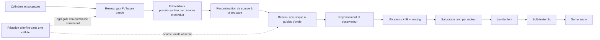
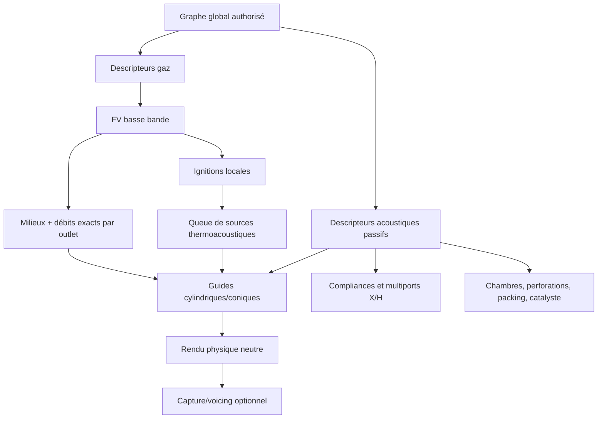

# Audit profond — son moteur, échappement, afterfire et dyno

Date des mesures : 10–11 août 2026

Révision auditée : `2f0feccf684ebaa53efe898e7c52905e280268c8` (`main`)

État du produit pendant l'audit : sources laissées intactes ; seuls ce rapport et des artefacts ignorés sous `out/audit-2026-08-10/` ont été créés.

## 1. Verdict exécutif

Le constat utilisateur est fondé, mais il faut le formuler précisément pour ne pas corriger le mauvais étage.

1. **Le graphe acoustique d'échappement tourne réellement.** Les pressions physiques des cylindres arrivent dans un réseau bidirectionnel, les délais varient avec la longueur et la célérité, les sections diffusent les ondes, les sorties rayonnent. La géométrie n'est donc pas entièrement ignorée.
2. **Le catalogue n'utilise presque pas ce graphe.** Les 16 moteurs livrés utilisent tous la synthèse scalaire historique ; aucun ne contient un graphe d'échappement authorisé. Le preset nommé `motorcycle_4_2_1` compile en vrai 4-en-1, le LS3 possède deux 4-en-1 indépendants sans X-pipe, et les « stacks individuels » du Merlin restent deux 6-en-1.
3. **Plusieurs propriétés éditables disparaissent avant l'acoustique.** Le volume des collecteurs, la fréquence de résonance, le type physique du composant et les vrais débits de chaque sortie ne sont pas consommés correctement par le réseau audio. À dimensions égales, tube, catalyseur, résonateur et silencieux sont donc beaucoup trop proches.
4. **L'afterfire n'est pas chimiquement mort.** Il consomme du carburant et libère de la chaleur. Mais la réaction est étalée dans les cellules, et aucun événement acoustique localisé n'est injecté au point de réaction. Le son ne reçoit qu'un effet indirect revenu jusqu'aux soupapes. Un pop bref est structurellement impossible dans ce chemin.
5. **Le mode 4 Hz explique exactement la vague périodique entendue.** C'est un hacheur global en temps absolu, sans lien avec les cycles/cylindres. À 35 % de duty il ne concentre pas une même énergie en poches : il supprime environ 65 % du carburant. La mesure ne donne que +0,63 à +0,75 dB de pic contre le contrôle nul.
6. **Appliquer les réglages audio/afterfire recrée le moteur et refroidit l'échappement.** L'utilisateur peut chauffer le système, cliquer « appliquer », puis repartir avec toutes les parois à l'ambiante.
7. **Le son ouvert traverse trop de non-linéarités mal observées.** Chaque moteur livré impose une saturation `tanh` artistique avant le leveler et le limiteur. La perte vortex physique disponible au bord d'une bouche ouverte n'est jamais activée côté échappement. Le diagnostic nommé « Limiter samples » compte en réalité le leveler lent et aucun compteur ne mesure le limiteur final.
8. **Le dyno continu possède une rampe lisse mais un enregistreur par blocs — et ne mesure pas la même grandeur que le banc catalogue.** Les fenêtres non chevauchantes durent 0,25 à 0,80 s, puis l'accumulateur est remis à zéro. À 500 tr/min/s, cela impose mécaniquement 125 à 400 tr/min entre points. Le CP2 mesuré monte à 406 tr/min de trou. En plus, l'application moyenne le couple instantané de fin de frame, tandis que le harness de calibration moyenne le travail intégré sur le cycle 720°. Le lissage graphique n'est donc ni la cause des trous, ni une garantie de cohérence métrologique.
9. **Le budget CPU ne permet pas d'ajouter aveuglément de la physique partout.** En Release, 15 moteurs sur 16 restent au-dessus du temps réel avec le chemin audio de production ; le Merlin n'atteint que `0,991x`. La bonne correction est un réseau passif enrichi et parcimonieux, activé uniquement sur les éléments qui en ont besoin, pas un CFD/3D audio-rate global.
10. **Les tests verts prouvent la stabilité, pas le réalisme.** Les 36 tests Release passent. Ils ne comparent toutefois jamais, à source identique et voicing neutre, quatre stacks, 4-1, 4-2-1, dual 4-1, H et X. Le corpus réel est intègre mais reste en schéma 2, sans fenêtres par condition ; aucune comparaison réelle condition-matched ne peut actuellement valider la fidélité.

Le chantier nécessaire est important, mais il ne demande pas de jeter tout le simulateur. Les solveurs FV, les sources de pression SI, les queues SPSC, les guides d'onde et la séparation des stems sont de bonnes fondations. Il faut corriger les contrats entre ces blocs, authoriser les vraies topologies et remplacer les substituts acoustiques par quelques éléments passifs physiquement définis.

## 2. Portée, méthode et limites de l'audit

### 2.1 Portée réellement couverte

L'inventaire comporte environ :

| Zone | Fichiers considérés | Lignes |
|---|---:|---:|
| `src/` | 146 | 42 997 |
| `tests/` | 18 | 9 123 |
| `tools/` | 20 | 12 428 |
| `engines/` | 16 | 1 143 |
| `parts/` | 6 | 624 |
| `docs/` | 48 | 10 482 |

La chaîne suivante a été relue de bout en bout : catalogue et normalisation, schémas d'échappement, compilation du graphe, layout gaz, FV, réaction d'afterfire, télémétrie et publication temps réel, reconstruction des sources, réseau acoustique, observateur, voicing/master, UI atelier/designer, banc dyno, harnesses et tests associés. Une recherche statique transversale a aussi couvert le reste de l'arbre.

Ce document **n'est pas** une certification ligne par ligne de toutes les fonctions sans rapport avec l'audio, le gaz ou le dyno, ni un audit sécurité/mémoire formel. Il ne faut pas le citer comme preuve que l'UI générale, la transmission ou tous les serializers sont exempts de bugs.

### 2.2 Protocole

- Relecture des contrats d'architecture existants avant mesure.
- Build Visual Studio 2022 Release, `/m:1`, depuis `out/build/windows-vs2022`.
- Mesures fraîches le même jour, en séquence, sans lancer plusieurs bancs lourds simultanément.
- Deux baselines de capacité du vrai `EngineRuntime`, dont une avec le vrai consommateur `RealtimeEngineAudio` à 48 kHz / 256.
- A/B afterfire nul, continu et pulsé après 60 s de chauffe.
- A/B de sensibilité géométrique LS3 et Hayabusa ; rejet explicite d'un run Hayabusa non stabilisé.
- Probe de la vraie session dyno continue CP2 et LS3, sans audio.
- Comparaison statique avec le mécanisme dyno d'ES2D.
- Exécution des 36 tests CTest Release et smoke test de l'exécutable.
- Validation cryptographique et décodage des dix références audio.

### 2.3 Ce qui n'a pas été mesuré

- Aucune écoute humaine n'a été fabriquée ou simulée par cet audit.
- Aucun banc matériel, microphone calibré ou échappement réel correspondant exactement à une configuration EngineLab n'était disponible.
- Le harness de géométrie ne sait pas varier une topologie DAG ; il ne peut donc pas mesurer directement 4-1 contre 4-2-1 ou X contre H.
- Le smoke test prouve que l'application reste vivante six secondes, pas qu'une session UI+audio complète respecte le budget sur tous les moteurs.
- Aucun correctif produit n'a été implémenté : ce rapport est le diagnostic et le contrat de correction demandé.

## 3. Résultats de validation fraîche

### 3.1 Build, tests et lancement

| Vérification | Résultat |
|---|---|
| Build VS2022 Release | réussi |
| CTest Release | 36/36, 0 échec, 805,45 s |
| Smoke `EngineLab.exe` Release | processus vivant après 6 s, arrêté volontairement |
| Manifest audio réel | 10/10 SHA-256 et décodage valides |
| Worktree avant rapport | propre |

Le log CTest complet est `out/audit-2026-08-10/ctest-full.txt`.

### 3.2 Capacité temps réel

Le facteur est le nombre de secondes simulées produites par seconde murale. `1,0` est juste l'équilibre et ne laisse aucune marge au scheduler.

| Moteur | Physique seule | Avec audio production | p99 callback audio |
|---|---:|---:|---:|
| K20A I4 | 1,490 | 1,448 | 36 % |
| 2JZ I6 turbo | 1,500 | 1,473 | 47 % |
| LS3 V8 | 1,133 | 1,087 | 59 % |
| EJ25 flat-4 turbo | 1,995 | 1,864 | 46 % |
| Audi I5 turbo | 1,612 | 1,665 | 44 % |
| Hayabusa I4 | 1,782 | 1,720 | 35 % |
| Big Twin V2 | 3,429 | 3,091 | 32 % |
| Merlin V12 | 1,144 | **0,991** | 74 % |
| Flat-6 aircooled | 1,270 | 1,211 | 51 % |
| Radial R5 | 2,372 | 2,300 | 36 % |
| Yamaha CP2 | 3,010 | 2,734 | 25 % |
| Yamaha CP3 | 2,043 | 1,831 | 33 % |
| Yamaha CP4 | 1,842 | 1,593 | 36 % |
| VW TDI I4 | 2,354 | 2,174 | 38 % |
| CP2 Full System | 3,093 | 2,778 | 26 % |
| Audio Physics Lab | 3,027 | 2,239 | 30 % |

Dans les deux runs : zéro overrun physique, zéro queue perdue, zéro événement audio tardif, zéro fallback legacy et zéro activité du leveler signalée. Les sorties sont :

- `out/audit-2026-08-10/realtime-free-run.txt`
- `out/audit-2026-08-10/realtime-with-audio.txt`

Attention : le harness calcule `maximumPreLimiterMagnitude`, mais ne l'affiche pas et ne le gate pas. Son compteur `lvl` est celui du leveler lent ; il n'existe pas de compteur pour le soft-limiter. Ces runs ne prouvent donc pas que toutes les non-linéarités de sortie sont inactives.

### 3.3 Sensibilité actuelle à la géométrie scalaire

| Mesure retenue | LS3, 3 s | Hayabusa, 6 s |
|---|---:|---:|
| Régime de référence observé | 3 535 tr/min | 6 219 tr/min |
| Retrait silencieux, mix | +4,07 dB | +1,56 dB |
| Retrait silencieux, stem échappement RMS | +4,90 dB | +2,30 dB |
| Retrait silencieux, pic physique observateur | +3,91 dB | +5,83 dB |
| Ajout garnissage, stem échappement | −2,45 dB | −2,51 dB |
| Pire écart de **forme** du mix | 7,84 dB | 6,07 dB |
| Pire écart de **forme** du stem échappement | 13,05 dB | 10,11 dB |
| Étendue de niveau mix / pression physique | 8,89 / 16,98 dB | 8,88 / 20,77 dB |
| AGC min / compteur `lvl` | 1,000 / 0 | 1,000 / 0 |
| Bandes où l'échappement est masqué | 5/28 | 8/28 |

Conclusion exacte : dire que longueur et diamètre ont **zéro** effet serait faux. Des variantes extrêmes déplacent la forme de 6 à 13 dB. En revanche :

- le banc ne change jamais de topologie ;
- les effets ordinaires sont beaucoup plus petits que les variantes extrêmes ;
- l'autorité des silencieux livrés est faible ;
- le mix et la chaîne de sortie réduisent une partie de l'étendue physique ;
- certains régimes varient entre variantes, donc le banc ne mesure pas une fonction de transfert sous source strictement identique.

Le run Hayabusa de 3 s, `exhaust-geometry-hayabusa.txt`, est rejeté : les variantes terminaient de 5 268 à 5 970 tr/min pour une cible de 6 160. Le run de 6 s est le seul retenu.

Sorties :

- `out/audit-2026-08-10/exhaust-geometry-ls3.txt`
- `out/audit-2026-08-10/exhaust-geometry-hayabusa-6s.txt`

### 3.4 Afterfire

Conditions : 60 s de chauffe, lever de pied proche de 4 000 tr/min, overrun de 3 s, seuil 800 K, constante de réaction 8 ms, carburant commandé 12 %, audio 48 kHz.

| Système | Stratégie | Carburant brûlé | Chaleur moyenne | Pic audio | p99,9 | Écart pic au nul |
|---|---|---:|---:|---:|---:|---:|
| CP2 Full System | nul | 0 mg | 0 kW | 0,10847 | 0,09508 | — |
| CP2 Full System | continu | 90,822 mg | 1,562 kW | 0,17823 | 0,14401 | +4,31 dB |
| CP2 Full System | 4 Hz / 35 % | 32,992 mg | 0,568 kW | 0,11660 | 0,10124 | **+0,63 dB** |
| Lab 689 | nul | 0 mg | 0 kW | 0,07324 | 0,06120 | — |
| Lab 689 | continu | 91,283 mg | 1,570 kW | 0,13957 | 0,10946 | +5,60 dB |
| Lab 689 | 4 Hz / 35 % | 29,166 mg | 0,502 kW | 0,07987 | 0,06984 | **+0,75 dB** |

Le carburant brûlé pulsé représente environ 36 % du continu, exactement l'ordre du duty 35 %. Le pulseur ne forme donc pas une poche plus énergétique ; il coupe l'alimentation 65 % du temps. Le mode continu donne un grondement/ripple, et le pulsé une modulation à peine perceptible.

Les six sorties sont `out/audit-2026-08-10/afterfire-*.txt` et `afterfire-fullsystem-*.txt`.

### 3.5 Dyno produit

Probe : vraie `EngineRuntime`, rampe 500 tr/min/s, aucun callback audio, aucune protection de charge active.

| Mesure | CP2 | LS3 |
|---|---:|---:|
| Points publiés | 32 | 38 |
| Plage du premier au dernier point | 2 019,5 → 9 455,6 tr/min | 1 271,6 → 6 239,0 tr/min |
| Écart minimum | 126,4 tr/min | 59,4 tr/min |
| Écart médian | **214,7 tr/min** | **126,1 tr/min** |
| p90 | **388,3 tr/min** | **166,4 tr/min** |
| Écart maximum | **406,1 tr/min** | **232,6 tr/min** |
| Gaps > 200 tr/min | 17/31 | 2/37 |
| Gaps > 300 tr/min | 7/31 | 0/37 |
| Gaps non monotones | 0 | 0 |
| Recoveries / load protection | 0 / 0 % | 0 / 0 % |
| Erreur absolue cible moyenne / max | 65,2 / 365,3 tr/min | 23,1 / 88,5 tr/min |
| Temps dans le gate ±150 tr/min | 93,1 % | 100 % |
| Erreur moyenne formule → gaps observés | 3,76 tr/min | 4,01 tr/min |

La formule `500 × clamp(5760 / (RPM × cylindres), 0,25, 0,80)` prédit les gaps observés à moins de 4,1 tr/min d'erreur absolue moyenne sur les deux moteurs. La cadence dépend donc causalement du nombre de cylindres/firings : elle n'est pas une grille de régime. Les logs et CSV sont :

- `out/audit-2026-08-10/dyno-ramp-cp2.log`
- `out/audit-2026-08-10/dyno-ramp-cp2.csv`
- `out/audit-2026-08-10/dyno-ramp-ls3.log`
- `out/audit-2026-08-10/dyno-ramp-ls3.csv`

Le CP2 expose aussi une courbe brute instable : 114,8 Nm à 5 714 tr/min puis 58,3 Nm à 5 958 tr/min. Le présent audit prouve le sous-échantillonnage et la publication par blocs ; il ne prétend pas attribuer toute cette variation de couple à une seule cause sans un oracle de couple supplémentaire.

## 4. Carte du chemin produit



Le point important est la flèche absente entre réaction locale et réseau acoustique. Le FV conserve l'énergie basse fréquence, mais sa maille et sa cadence ne peuvent porter seules le front audio d'une inflammation brève. Revenir indirectement jusqu'à la soupape place ensuite la source au mauvais endroit.

## 5. Registre priorisé des défauts

Définition :

- **P0** : bloque directement un comportement explicitement demandé ou ment sur la topologie/le réglage appliqué.
- **P1** : dégrade fortement le réalisme, l'identité ou l'observabilité, sans rendre tout le chemin inopérant.
- **P2** : dette de modèle, d'authoring ou de validation à traiter après les contrats P0/P1.

| ID | Priorité | Défaut vérifié | Correction de fond |
|---|---|---|---|
| AF-01 | P0 | Appliquer la physique reconstruit `EngineRuntime` et remet gaz/parois à l'ambiante | Snapshot de calibration live, sans reconstruction de l'état physique |
| AF-02 | P0 | Toggle afterfire actif avec fraction carburant nulle acceptée ; 15/16 moteurs n'authorisent rien | Stratégies explicites et validation sémantique d'une masse non nulle |
| AF-03 | P0 | Pulseur global 4 Hz, temps absolu, masse moyenne multipliée par le duty | Ordonnanceur mg/cycle par cylindre, masse moyenne indépendante du duty |
| AF-04 | P0 | Réaction du premier ordre étalée dans toute cellule chaude, sans induction/poche/extinction | État compact d'induction, inflammabilité, quench et ignition localisée |
| AF-05 | P0 | Aucun événement de réaction local ne rejoint l'audio | Événement thermoacoustique borné injecté au bon nœud via SPSC |
| EX-01 | P0 | 0/16 graphe authorisé ; les noms 4-2-1/X/stacks ne correspondent pas au graphe compilé | Authoriser et snapshotter les vraies topologies du catalogue |
| EX-02 | P0 | Graphe enfermé par path, DAG strict, aucun X/H multiport inter-bancs | Graphe global et jonction multiport passive X/H |
| EX-03 | P0 | `resonanceHz`, type et propriétés éditées n'ont pas de consommateur acoustique équivalent | Descripteurs gaz/acoustique distincts ; vrais deux-ports/branches |
| EX-04 | P0 | `CompiledExhaustJunction::volumeM3` n'est jamais lu par l'acoustique | Compliance passive de jonction ou chambre distribuée |
| EX-05 | P0 | Le Mach de chaque outlet reçoit le débit complet du path ; le jet reçoit une répartition par aire | Publier et consommer le débit signé FV de chaque outlet |
| EX-06 | P0 | Perte vortex non linéaire disponible mais jamais activée aux bouches d'échappement | Coefficient dérivé du bord, du débit et de la géométrie, avec passivité |
| EX-07 | P0 | « Générer depuis legacy » n'est pas neutre : il retire des longueurs cachées | Une seule compilation canonique ; test transfert/route avant-après |
| OUT-01 | P1 | Saturation `tanh` non nulle sur 16/16 moteurs avant diagnostics, non suréchantillonnée | Baseline physique neutre ; effet capture optionnel et instrumenté |
| OUT-02 | P1 | UI appelle le compteur du leveler « limiter » ; vrai soft-limiter non compté | Compteurs séparés AGC, tanh, limiter et clamp, réduction en dB |
| EX-08 | P1 | Taper propagé comme ligne cylindrique moyenne, sans Webster/normalisation puissance | Deux-port conique ou 2–8 sections passives |
| EX-09 | P1 | Cutoff modal détruit la haute bande du mode plan au lieu de redistribuer l'énergie | Quelques modes transverses/diffus uniquement dans gros volumes |
| EX-10 | P1 | Silencieux catalogue = surtout une chambre réactive ; atténuation mesurée faible | Bibliothèque chambres/perforations/packing/catalyseur mesurée |
| ID-01 | P1 | Aucun moteur n'authorise de NVH structurel ; fallback boîte aluminium estimée | Données modales mesurées/calculées avec provenance par famille/moteur |
| VAL-01 | P1 | Corpus réel schéma 2, RPM majoritairement inconnu, aucune fenêtre par condition | Manifest schéma 3, conditions/RPM/micro documentés, écoute aveugle |
| DY-01 | P0 | Rampe réutilise l'accumulateur non chevauchant du banc stabilisé | Estimateur roulant séparé de l'échantillonneur de courbe |
| DY-02 | P0 | Application : couple instantané de fin de frame ; harness catalogue : travail intégré sur 720° | Un `CompletedBrakeCycleSample` autoritaire consommé par les deux chemins |
| DY-03 | P1 | La cible avance sur couple >1,4 Nm sans exiger contact ni suivi ; le recorder accepte ±150 tr/min | Gate commun contact/suivi avec pause et hystérésis |
| DY-04 | P1 | Rampe OFF par défaut, cachée derrière touche 6 ; modes hold/ramp non exclusifs | `DynoMode` exclusif, figé au départ, commande/rate/qualité visibles |
| DY-05 | P1 | Run sans statut, provenance ni qualité ; archives/export et graphe fragiles | Session immuable, métadonnées/hash/stop reason, historique autoritaire et filtre en RPM |
| TEST-01 | P1 | Les harnesses ciblés ne sont pas tous des tests et plusieurs métriques sont invalides | Oracles déterministes courts dans CTest + instruments longs d'audit |

## 6. Afterfire — causes racines et architecture correcte

### 6.1 AF-01 — l'application refroidit le système

Chemin vérifié :

- `src/app/src/MainComponent.cpp:528-533` copie la config et appelle `applyConfig`.
- `MainComponent.cpp:187-230` construit un nouvel `EngineRuntime`, coupe audio/runtime et remplace les objets.
- `src/simulation/src/EngineSimulator.cpp:600-622` initialise le réseau et les parois à l'ambiante.
- `src/app/src/AudioWorkshopWindow.cpp:753-764` confirme dans l'UI : « Le moteur a redémarré ».

Ce comportement contredit directement le geste utilisateur « je chauffe, puis j'active ». Les paramètres afterfire, COV et limiteur humide sont des calibrations ECU/chimie, pas des changements de topologie nécessitant de détruire l'état.

**Correction :** publier un `RuntimeCalibrationSnapshot` immuable au début d'une frame physique. Les setters écrivent une nouvelle génération dans un double-buffer ou un pointeur atomique ; le thread physique l'adopte entre deux frames. RPM, angle, espèces, films carburant, températures, queues et état audio restent inchangés. Seuls les changements structurels de cylindres/topologie reconstruisent le runtime.

### 6.2 AF-02 — « activé » peut signifier zéro carburant

- Defaults `enabled=false`, `overrunFuelFraction=0` dans `EngineTypes.hpp:377-410`.
- Le toggle relit simplement le slider courant dans `AudioWorkshopWindow.cpp:712-724`.
- `validateEngineConfig` accepte `enabled=true` et fraction nulle.
- Un seul moteur, `16_audio_physics_lab_689_twin.engine.yaml`, authorise l'afterfire ; son pulse reste à 0 Hz, donc continu.

**Correction :** remplacer les booléens ambigus par :

```text
OverrunStrategy = CleanDfco | ContinuousAntiLag | DiscreteAfterfire
OverrunFuelTarget = map(RPM, preLiftLoad, wallSiteTemperature) -> mg/cycle
```

Une stratégie qui requiert du carburant doit refuser une carte vide ou afficher clairement `ACTIF — cible 0 mg/cycle`.

### 6.3 AF-03 — le hacheur 4 Hz fabrique la régularité et retire l'énergie

`SimpleEcuModel.cpp:427-433` calcule une phase avec `simulationTimeSeconds modulo 1/pulseHz`. Le fuel correction ouvert reste la fraction nominale (`:481-493`) ; aucune compensation `1/duty` n'existe. Le pulse n'est corrélé ni au vilebrequin, ni à une soupape, ni à l'injecteur, ni au site d'ignition.

**Correction :**

1. calculer une masse cible en mg/cycle à partir du régime et de la charge juste avant lift-off ;
2. planifier les injections sur des opportunités cylindre/cycle ;
3. regrouper plusieurs opportunités dans une poche, sans changer la masse moyenne demandée tant que l'injecteur n'est pas saturé ;
4. publier séparément cible, masse électrique commandée, injectée, vaporisée, brûlée cylindre, rejetée et brûlée dans l'échappement ;
5. laisser la dispersion d'ignition venir de l'induction/température/mélange, avec un bruit déterministe seedé pour la reproductibilité.

### 6.4 AF-04 — la chimie produit une chauffe étalée

`ExhaustGasNetwork.cpp:528-635` balaie cellules et jonctions à chaque couplage et brûle une fraction `1-exp(-dt*activation/tau)` dès que le gaz ou la paroi dépasse le seuil. Il manque :

- un délai d'induction persistant ;
- une fenêtre d'inflammabilité/richesse ;
- une masse minimale accumulée ;
- extinction/quench ;
- noyau/front de flamme ;
- dépendance pression/dilution ;
- paroi thermique propre des jonctions.

**Correction CPU-réaliste :** ajouter par volume réactif quelques scalaires : inventaires déjà présents, richesse, intégrale d'induction type Livengood-Wu, état `unignited/burning/quenching`, énergie restante. Le calcul reste exactement bypassé quand aucun réactif ou stratégie afterfire n'est actif. Une ignition libère l'énergie conservativement sur une durée physique courte et publie son lieu.

### 6.5 AF-05 — aucune source acoustique locale

`ExhaustFuelReactionResult` (`ExhaustGasNetwork.hpp:160-170`) ne transporte que masse/énergie/comptage globaux. `CylinderPressureSample` et `RealtimeAudioState` ne possèdent aucun événement afterfire. `AcousticExhaustNetwork::process` reçoit uniquement les sources cylindre. La réaction est donc acoustiquement ramenée aux soupapes au lieu d'être émise dans le collecteur/X/catalyseur.

Contrat proposé, sans allocation :

```text
ExhaustReactionSource {
  simulationTime;
  pathId;
  componentOrJunctionId;
  axialPosition01;
  releasedEnergyJ;
  burnedFuelKg;
  durationSeconds;
  pressurePa;
  densityKgM3;
  soundSpeedMps;
}
```

- Queue SPSC bornée physique → audio.
- Injection bidirectionnelle comme source de volume/monopôle thermoacoustique au nœud exact.
- Amplitude issue de l'énergie locale, jamais d'un sample de pop ou d'un oscillateur.
- Crossover documenté pour éviter de compter deux fois la basse bande déjà portée par le FV.
- Le même événement doit ensuite être naturellement filtré par le collecteur, le X/H, le silencieux et les sorties.

### 6.6 Défauts secondaires afterfire

- `overrunAfterfireActive` ne contient pas `overrunAfterfireArmed`, alors que le masque ajoute `notArmed` (`SimpleEcuModel.cpp:435-480`). Le booléen et le diagnostic peuvent diverger lorsque le post-start a expiré. Soit l'armement devient une vraie condition, soit `notArmed` doit cesser d'être appelé blocker.
- Le film d'injection port continue physiquement à vaporiser entre les créneaux ; l'ECU assimile à tort créneau électrique et poche parvenue à l'échappement.
- `peakWallTemperatureK()` affiche le maximum de toutes les cellules, pas la température au volume qui contient simultanément carburant et oxygène.
- Toutes les parois échappement utilisent 1,5 mm d'inox et les mêmes propriétés, quel que soit composant.
- Le compilateur `.els` n'expose pas fréquence et duty, alors que YAML/JSON les connaissent.

### 6.7 Gates afterfire

1. Modifier/activer l'afterfire ne change ni RPM, ni angle, ni inventaire, ni film, ni température, hors tolérance de publication.
2. `active == (blockerMask == 0)` si le masque conserve ce sens.
3. Désactivé ou cible nulle : aucune masse brûlée et aucun événement audio après settling défini.
4. À masse moyenne identique, duties 20/35/70 % : masse brûlée sur 3 s à ±5 %, sauf saturation injecteur explicitement signalée.
5. Pulsé chaud : duty de réaction nettement inférieur au continu et facteur de crête supérieur.
6. Délai source → chaque outlet compatible avec distance/célérité à quelques échantillons près.
7. Déplacer la même ignition avant/après X ou silencieux change délai, spectre et décroissance comme le réseau l'impose.
8. CP2 Full System, snapshot thermique identique : pulsé > nul de 3 dB minimum au pic et p99,9, sans tanh/AGC/limiteur.
9. Le contrôle nul ne peut pas annoncer 100 % de duty pour 0,000 kW.
10. Coût désactivé statistiquement nul ; activé <5 % sur le pire moteur, à revalider le même jour.

## 7. Échappement — authoring, compilation et physique acoustique

### 7.1 EX-01 — les topologies du catalogue ne sont pas celles annoncées

Recherche fraîche : aucun `graph:`/`network:` authorisé dans les 16 fichiers moteur. Cinq moteurs seulement définissent plusieurs `exhaust_paths`; les autres héritent d'un path scalaire tous cylindres.

Le compilateur legacy (`src/exhaust/src/ExhaustGraph.cpp:389-493`) crée toujours :

```text
cylindre -> primaire
plusieurs primaires -> un merge
merge -> un corps "muffler"
muffler -> une sortie
```

Même sans chambre configurée, il crée un conduit commun de 450 mm et une sortie de 180 mm.

Conséquences catalogue :

- `parts/exhausts.yaml:73-82` : `motorcycle_4_2_1` ne contient que cinq scalaires ; il devient 4-1.
- `engines/03_gm_ls3_like.engine.yaml:47-49` : deux paths bancaires indépendants ; aucun X/H.
- `parts/exhausts.yaml:171-182` : le commentaire Merlin reconnaît qu'un collecteur large remplace l'atmosphère commune exigée par le modèle ; le moteur reste deux 6-1.
- Flat-6 : deux 3-1, pas six stacks.
- Le preset CP2 Full System documente que le diamètre de corps 72 mm est choisi pour obtenir le son voulu et non pour représenter le corps réel de 100–110 mm (`parts/exhausts.yaml:102-130`). Le catalogue calibre donc déjà autour d'une faiblesse de modèle.

**Correction :** convertir chaque moteur livré vers un graphe explicite vérifiable. Le nom marketing ne doit plus être une preuve ; un snapshot machine-readable doit compter cylindres, merges, splits, crossovers, sorties, routes et longueurs par route.

### 7.2 EX-02 — un vrai X/H n'est pas représentable proprement

- `ExhaustNetworkConfig` est local à un `ExhaustPathConfig`.
- Chaque cylindre appartient à un seul path.
- Le schéma n'offre que `pipe, merge, splitter, resonator, muffler, catalyst, outlet`.
- La validation impose un DAG et rejette tout cycle (`EngineTypes.cpp:1190-1204`).

Un merge suivi d'un splitter dans **un** path forme un nœud commun idéal. Les jonctions adjacentes sans longueur sont même fusionnées par `AcousticExhaustNetwork.cpp:184-213`. Cela peut approximer un plénum 4 ports à basse fréquence, mais ne préserve aucune direction droite/croisée, aucun angle et aucun couplage fréquentiel. Il ne relie pas les deux paths bancaires du LS3. Un H-pipe entre deux branches parallèles introduit en outre une boucle que le DAG interdit.

**Correction :** graphe d'échappement global, ports appartenant à des banques plutôt que graphes isolés, et composant multiport dont la matrice de scattering est passive/réciproque. X et H portent longueur, sections, angle et pertes ; un dual séparé reste exactement découplé.

### 7.3 EX-03 — des contrôles du designer n'atteignent pas l'acoustique

`ExhaustComponentConfig` expose `restriction`, `resonanceHz`, `acousticGain`, `volumeLitres`, type, garnissage et géométrie (`EngineTypes.hpp:346-375`). L'UI les édite et sérialise.

Le layout gaz ignore volontairement `audioGain` et `resonanceHz` (`ExhaustNetworkLayout.hpp:134-138`), ce qui est correct pour la conservation du gaz. Mais le layout donné à `AcousticExhaustNetwork` ne transporte ensuite que dimensions, sections, milieu et packing. Le réseau audio ne reçoit ni un modèle acoustique propre au type, ni la résonance authorisée. La restriction agit sur le gaz/source en amont, pas comme l'impédance acoustique complexe que l'UI laisse supposer.

À géométrie identique :

- un `catalyst` n'est pas un monolithe poreux ;
- un `resonator` n'est pas une branche Helmholtz/quart d'onde ;
- un `muffler` n'est qu'une section/chambre éventuellement garnie ;
- `resonanceHz` n'accorde rien dans le chemin physique de production.

**Correction :** séparer `GasElementDescriptor` et `AcousticElementDescriptor`. Les champs sans consommateur doivent être refusés/masqués, pas silencieusement conservés.

### 7.4 EX-04 — le volume des collecteurs est perdu acoustiquement

`CompiledExhaustJunction::volumeM3` est calculé (`ExhaustNetworkLayout.cpp:77-103`), mais `AcousticExhaustNetwork` ne le lit jamais. Les jonctions audio sont des N-ports ponctuels à pression commune (`AcousticExhaustNetwork.cpp:853-910`). Le volume peut donc modifier le gaz moyen, mais ni compliance, ni accord, ni mode bas du collecteur.

**Correction :**

- jonction compacte : compliance lumped passive avec état de pression/volume ;
- volume non compact : vraie chambre/segment distribué ;
- sélection par rapport dimension maximale / longueur d'onde, pas par preset.

Gate : à cols identiques, doubler `V` déplace le mode bas près de `1/sqrt(V)` sans inventer une longueur de tronc.

### 7.5 EX-05 — débit incohérent aux sorties

Le FV expose déjà `ExhaustOutletFlowSample` par `outletNodeId`, avec débit signé, densité, vitesse et température (`ExhaustGasNetwork.hpp:116-131`). `EngineSimulator.cpp:2466-2471` les réduit pourtant en masse sortante positive globale. L'audio reconstruit ensuite le débit du path en sommant les **valeurs absolues** des débits aux cylindres (`RealtimeEngineAudio.cpp:1224-1227`).

Dans `AcousticExhaustNetwork.cpp:718-756` :

- chaque outlet reçoit le débit complet du path pour le Mach et la réflexion convective ;
- le bruit de jet répartit au contraire ce débit par aire totale.

Un splitter asymétrique ne peut donc pas avoir une terminaison et un jet cohérents.

**Correction :** publier les échantillons FV par sortie jusque dans l'audio et utiliser la même grandeur signée pour terminaison, jet, diagnostic et balance observateur.

### 7.6 EX-06 — bouche ouverte sans perte vortex physique

`PipeRadiationModel` possède une résistance vortex non linéaire passive (`PipeRadiationModel.cpp:49-103`). L'admission l'active (`AcousticIntakeNetwork.cpp:293-302`). La préparation échappement (`AcousticExhaustNetwork.cpp:587-599`) n'appelle jamais `setNonlinearLossCoefficient`; le défaut vaut donc 0.

C'est un candidat physique direct au ringdown trop long/agressif des tubes ouverts. Il faut l'activer à partir de la géométrie du bord, de l'end correction, du Strouhal et du débit moyen, puis prouver : bas niveau inchangé, perte croissante avec amplitude, bilan passif.

### 7.7 EX-07 — migration designer non neutre

`makeEditableExhaustNetwork` (`LegacyExhaustNetwork.cpp:20-104`) omet le muffler quand aucune chambre n'est configurée, met le merge à longueur zéro et l'outlet à longueur zéro. Le layout résout ensuite seulement cet outlet nul vers environ `0,853*diamètre`.

Le compilateur scalaire, lui, ajoutait merge 120 mm + conduit commun 450 mm + outlet 180 mm. Sur un système ouvert, cliquer « Générer depuis legacy » peut donc retirer plus d'un demi-mètre de trajet commun avant même toute édition.

Le test nommé `testEditableLegacyConversionIsNeutral` (`ExhaustGraphTests.cpp:555-599`) vérifie les champs et l'absence d'un muffler visuel, mais ne compare ni longueur de route, ni transfert, ni flow, ni réponse impulsionnelle. Son nom promet plus que son oracle.

**Correction :** une unique fonction canonique doit produire à la fois le graphe runtime et la représentation éditable. La conversion doit conserver chaque longueur/volume réel sous un composant explicitement visible. Gate : mêmes layouts gaz/acoustique, mêmes routes et réponse impulsionnelle avant/après à tolérance numérique.

### 7.8 EX-08 — tapers et conservation de puissance

Le layout garde aire d'entrée, de sortie et moyenne. L'audio alloue pourtant une seule ligne de délai/rayon moyen ; seules les admittances terminales voient les sections. Il n'implémente ni guide conique de Webster, ni normalisation en ondes de puissance.

**Correction :** deux-port conique exact lorsque possible, sinon 2 à 8 cylindres étagés selon le flare. Tous les éléments doivent être testés en ondes `sqrt(Z)` avec erreur d'énergie <1 %, réciprocité et comparaison analytique.

### 7.9 EX-09 — le cutoff modal annihile de l'énergie

`DuctModeCutoff` applique un Butterworth ordre 4 au cutoff du premier mode transverse, à chaque traversée dans les deux directions. Le cutoff indique la fin de validité du modèle 1D, mais le mode plan ne cesse pas physiquement d'exister : des modes supplémentaires commencent à propager et les discontinuités redistribuent l'énergie.

Le filtre actuel assimile cette redistribution à une disparition totale de la haute bande du canal. Dans une grande chambre, il peut donc rendre plusieurs moteurs artificiellement sombres et similaires.

**Correction CPU-réaliste :** une à trois branches modales seulement pour les grandes sections dont le cutoff tombe dans l'audible, ou un petit réservoir diffus/rayonné conservant la puissance. Ne rien allouer aux primaires étroits dont les modes restent hors bande.

### 7.10 EX-10 — silencieux trop simples

Le catalogue le documente honnêtement : une seule chambre réactive, volontairement modeste. Seul le preset de laboratoire `cp2_absorptive_lab` (moteur Audio Physics Lab) authorise du packing poreux ; le CP2 Full System livré à l'écoute reste sec. Il n'existe pas de bibliothèque de :

- chambres multiples ;
- tubes perforés internes ;
- absorption distribuée réaliste ;
- résonateurs quart d'onde/Helmholtz branchés ;
- monolithes catalyseur ;
- valves/flaps ;
- matériaux et parois thermiques propres au composant.

Le retrait du silencieux ne donne que +1,56 à +4,07 dB au mix dans les mesures présentes. Une chambre extrême `x5,3` prouve toutefois que le solveur peut générer >10 dB de changement : le manque d'autorité vient surtout de l'élément authorisé, pas d'une impossibilité fondamentale du guide d'onde.

**Correction :** modèles passifs composables, caractérisés par géométrie et données matériau, validés d'abord contre fonctions de transfert analytiques/mesurées, puis utilisés par les vrais graphes catalogue.

## 8. Chaîne de sortie, saturation et identité

### 8.1 OUT-01 — la saturation artistique est obligatoire dans le catalogue

Les 16 fichiers `voicing/engines/*.yaml` fixent `saturation_drive` entre 0,10 et 0,44. LS3 = 0,34, Big Twin = 0,44, Hayabusa = 0,10. `RealtimeEngineAudio.cpp:392-397` applique :

```text
tanh((1+drive) * x) / (1+drive)
```

avant le leveler et le soft-limiter (`:1914-2005`). Cette non-linéarité n'est pas suréchantillonnée. Le test `AudioVoicingTests.cpp:65-91` exige même que chaque moteur ait un profil audible non neutre.

Ce point ne prouve pas que le `tanh` explique à lui seul toute saturation entendue. Les runs stationnaires n'ont pas engagé le leveler et le harness ne mesure pas sample-exactement l'entrée du `tanh`. Il prouve en revanche qu'une distorsion artistique, propre au moteur, est toujours présente dans la référence « production » et peut masquer/comprimer les différences physiques d'un système ouvert.

**Correction :**

- mode `PhysicalReference` : shelves unité, saturation 0, IR/capture optionnelle, calibration Pa→FS commune ;
- mode `Capture/Monitor` explicite et bypassable ;
- si saturation artistique conservée : suréchantillonnée, THD/alias mesurés, provenance affichée ;
- aucun test de physique ne doit dépendre d'un profil de voicing.

### 8.2 OUT-02 — observabilité incorrecte

Le renderer :

- compte `levelLimitedSamples_` quand `levelGain_ < 0,99999` (`RealtimeEngineAudio.cpp:1951-1974`) ;
- applique ensuite le soft-limiter à partir de 0,82 (`:1975-2005`, `:2296-2305`) sans compteur ;
- clamp finalement à ±0,999 sans compteur.

L'UI affiche pourtant ce premier compteur comme `Limiter samples` et son commentaire l'attribue au soft-limiter (`MainComponent.cpp:1424-1430`). Le harness stocke le pic pré-limiteur mais ne l'imprime pas.

**Correction :** télémétrie distincte : `voicingSaturatedSamples`, THD/alias offline, `agcActiveSamples`, gain min/réduction max dB, `softLimitedSamples`, réduction max, `hardClampedSamples`, peak true-peak avant/après.

### 8.3 ID-01 — identité structurelle générique

Le schéma accepte des modes structurels mesurés/calculés avec provenance. Aucun des 16 moteurs ne les authorise. `StructuralModalRadiator.cpp:118-170` utilise donc partout une « hollow-box block and thin-plate head family estimate », dont les dimensions sont dérivées du bore, stroke et rod parce que le schéma ne connaît pas le bloc.

Les firing orders, pressions cylindre, admission, géométrie et suralimentation créent déjà une identité réelle ; tout n'est pas générique. Mais les radiations de bloc/culasse restent une famille synthétique, et les topologies d'échappement fausses retirent justement une autre source majeure d'identité.

**Correction :** authoriser par famille puis par moteur : dimensions bloc/culasse, matériau, masses modales, fréquences, damping, surfaces, efficacité de rayonnement et participation cylindres. Provenance `estimatedFamily`, `calculated` ou `measured` obligatoire et visible.

### 8.4 VAL-01 — aucune preuve actuelle de ressemblance réelle

`references/real-engine-audio/manifest.json` est en schéma 2. Les dix assets passent SHA-256 et décodage, mais les RPM sont généralement inconnus et il n'existe pas de `segment_windows` par condition. `AbClipRenderer.cpp:271-397` accepte ce schéma pour intégrité, mais refuse correctement de réutiliser une même fenêtre pour idle, rev-up et overrun sans opt-in non apparié.

Il n'existe donc pas de verdict A/B condition-matched publiable sur la version actuelle. Les commentaires d'anciennes écoutes peuvent orienter une hypothèse, pas prouver la fidélité du HEAD.

**Correction :** corpus schéma 3 avec segments annotés, RPM/charge, topologie d'échappement, micro/distance, processing et licence ; renders physical-neutral loudness-matched par segment ; écoute aveugle multi-auditeurs ; conservation des scores et commentaires avec révision binaire.

## 9. Dyno — cause exacte et correction

### 9.1 DY-01 — la rampe et l'enregistreur n'ont pas été séparés

`dynoAveragingWindowSeconds` (`EngineRuntime.cpp:74-90`) demande 48 allumages puis borne la fenêtre à 0,25–0,80 s. `EngineRuntime.cpp:777-897` accumule uniquement tant que le gate de suivi est vrai, publie une moyenne quand la fenêtre est pleine, puis remet accumulateur, compteur et durée à zéro.

La rampe ajoutée dans `EngineRuntime.cpp:667-687` avance pourtant le target en continu. À 500 tr/min/s :

```text
écart de publication = vitesse de rampe * fenêtre non chevauchante
                     = 500 * [0,25 ; 0,80]
                     = [125 ; 400] tr/min
```

Le code et le test connaissent ce comportement. `CoreTests.cpp:2634-2676` ralentit volontairement la rampe à 150 tr/min/s, attend seulement cinq points et exige un gap <130 pour distinguer la rampe des paliers. Il évite donc la configuration utilisateur par défaut au lieu d'en valider la qualité.

Le filtre d'affichage (`MainComponent.cpp:1784-1816`) fait une moyenne triangulaire 0,25/0,50/0,25 des **valeurs** mais ne crée aucun point. Il ne peut pas combler les trous de RPM.

### 9.2 DY-02 — deux bancs, deux définitions du couple

Le commentaire `EngineRuntime.cpp:798-813` affirme que l'application et `DynoSweepHarness` mesurent maintenant la même quantité. Les lignes qui suivent contredisent ce commentaire :

- `EngineRuntime.cpp:814-817` accumule `frame.state.torqueNm` et `torqueNm × angularVelocity` à chaque frame acceptée ;
- `EngineSimulator.cpp:2756-2794` met dans `torqueNm` le couple freiné du **dernier sous-pas**, donc un instant de la pulsation de combustion ;
- `EngineSimulator.cpp:3190-3230` possède déjà les intégrales de travail sur un cycle 720° et publie `cycleAveragedTorqueNm` / `cycleAveragedPowerKw` à la frontière de cycle ;
- `DynoSweepHarness.cpp:263-264` moyenne précisément ces valeurs intégrées.

Le filtre temporel de l'application peut atténuer des pulsations, mais il ne transforme pas rigoureusement des échantillons de fin de frame en moyenne angulaire, surtout lorsque la fenêtre commence et finit à des phases arbitraires. La courbe utilisateur et la calibration catalogue ne sont donc pas directement comparables.

**Correction :** faire publier par `EngineSimulator` un record immuable `CompletedBrakeCycleSample {cycleId, t0, t1, rpmMean, brakeWorkJ, torqueMean, powerMean, valid}` à chaque cycle complet. Le produit, le banc par paliers, le pull continu et les exports consomment tous cette autorité. Aucun instrument ne reconstruit sa propre définition à partir d'un état instantané.

### 9.3 DY-03 — la rampe peut avancer hors contact et hors gate

`EngineRuntime.cpp:667-687` avance la cible dès que `cycleAveragedTorqueNm > 1,4`, sans vérifier l'erreur de suivi ni `DynoAbsorberOutput::contacted`. Pourtant le frein n'entre progressivement en contact que dans les 60 derniers tr/min (`DynoAbsorberController.cpp:75-128`), tandis que l'enregistreur de rampe accepte ±150 tr/min (`EngineRuntime.cpp:777-839`). Une cible peut donc avancer alors que le frein est encore nul, et une partie de cette zone peut même être enregistrée.

La mesure CP2 rend le risque concret : erreur cible moyenne 65,2 tr/min, maximum 365,3 tr/min, et 6,9 % du temps hors du gate ±150. Le target continue pourtant sa trajectoire jusqu'au plafond. Les runs audités n'ont pas déclenché le recovery ; cette protection contre le quasi-calage ne corrige pas l'absence de contact métrologique.

**Correction :** un même `DynoQualityGate` doit gouverner contrôleur et recorder : moteur chaud selon protocole, contact effectif, erreur et accélération dans les bornes, absence de saturation/recovery. En rampe, perte du gate = cible mise en pause, fenêtre invalidée et reprise avec hystérésis ; le gap résultant reste explicitement marqué, jamais masqué.

### 9.4 Ce qu'ES2D fait mieux, précisément

Dans `C:/Users/t3anc/OneDrive/Bureau/es2d` :

- `include/simulator.h:28` : ring de 512 échantillons.
- `src/simulator.cpp:125-145` : indexé par angle sur 720° et rempli continûment.
- `simulator.cpp:183-197` : couple filtré = moyenne du ring roulant, puissance dérivée.
- `src/oscilloscope_cluster.cpp:29-30,232-258` : affichage ajoute un point toutes les 0,25 s.

ES2D sépare donc le filtrage physique roulant de la cadence du graphe. À 500 tr/min/s, son graphe ajoute environ un point par 125 tr/min, sans jeter/recommencer la fenêtre de couple. Cela ne prouve pas qu'ES2D est supérieur dans tous les sous-systèmes ; cela explique pourquoi son dyno paraît plus continu.

### 9.5 Architecture dyno recommandée

Conserver deux instruments distincts :

1. **Banc stabilisé de calibration** : paliers, settling, fenêtres indépendantes, utilisé pour les points constructeur et la validation physique.
2. **Pull continu utilisateur** : estimateur roulant et publication dense.

Pour le pull continu :

- ring angle-indexé ou événements de firing, couvrant la fenêtre choisie (par exemple 48 firings) ;
- sommes roulantes O(1), sans reset après publication ;
- chaque échantillon de cycle conserve timestamp, angle, RPM, travail, couple et validité ;
- publication lors du franchissement de bins fixes de 25 ou 50 tr/min, avec interpolation temporelle au bin ;
- points adjacents assumés corrélés, avec largeur de fenêtre/effective sample count exposés ;
- gate de tracking qui marque les bins invalides au lieu de créer silencieusement un grand trou ;
- raw physique conservé pour export ; filtre d'affichage séparé et optionnel.

Cette correction coûte une petite ring buffer et quelques additions par cycle, pas une simulation plus fine. Les responsabilités deviennent explicites : `DynoController` commande, `DynoEstimator` agrège les cycles autoritaires, `DynoRecorder` rééchantillonne et documente.

### 9.6 DY-04/DY-05 — UX, session, graphe et historique

- Rampe OFF par défaut (`EngineRuntime.hpp:187-201,348-351`).
- Activation seulement via l'action clavier associée à `6`, absent du README ; aucun contrôle visible de vitesse.
- Hold et ramp sont deux booléens simultanément activables et encore modifiables pendant un run.
- Le mode est indiqué dans le panneau LOAD, pas dans le chart dyno.
- `DynoRun` ne contient ni timestamp, mode/rate, statut/raison d'arrêt, hash moteur/échappement/calibration, température initiale, nombre de cycles, variance ou métrique de qualité. Toute session d'au moins trois points est archivée, y compris une annulation ou un timeout (`EngineRuntime.cpp:506-518`). Le tuner ECU reste mutable pendant la mesure.
- Le filtre visuel 0,25/0,50/0,25 travaille par **indice** sur des gaps de 59 à 406 tr/min, utilise un point futur et laisse les extrémités brutes (`MainComponent.cpp:1784-1816`). Il doit être précédé d'un rééchantillonnage en RPM ; un filtre causal ou PCHIP sans overshoot est ensuite un choix de rendu, jamais une donnée brute.
- L'axe X force au moins 8 500 tr/min et les maxima Y agrègent toutes les archives, même d'autres moteurs. Les courbes non sélectionnées restent dessinées : seule leur opacité change (`MainComponent.cpp:1744-1825`).
- La suppression agit sur une copie UI alors que `EngineRuntime` possède déjà `deleteDynoRun`. L'app recopie périodiquement l'historique et remplace ses IDs ; le CSV n'embarque aucune métadonnée de session (`MainComponent.cpp:685-770`).

**Correction :** remplacer les deux booléens par un `DynoMode {SteppedCalibration, ContinuousRamp, Hold}` exclusif et figer un `DynoSessionConfig` au départ. Le runtime possède l'historique autoritaire ; l'UI ne fait que référencer les IDs stables. Chaque run porte `Running/Completed/Cancelled/TimedOut/Invalid`, sa raison d'arrêt, sa provenance et ses métriques. CSV/JSON round-trip conservent ces champs et les noms de pression distinguent statique, totale et contre-pression.

### 9.7 Tests et gates dyno

- Le test rampe de `CoreTests.cpp:2634-2676` utilise 150 tr/min/s, s'arrête après cinq points et ne valide ni le défaut produit à 500, ni la fin de run, ni le catalogue.
- `UserDynoHarness` ne teste pas le mode rampe.
- CTest ne demande au banc utilisateur que trois points CP2 par paliers.
- Les pulls audités commencent avec les fluides/parois proches de l'ambiante, sans protocole thermique comparable au banc catalogue.

Gates proposés à 500 tr/min/s :

1. CP2 et LS3 complets, bins 25/50 tr/min, gap max <= 1 bin hors segment explicitement invalide.
2. Monotonie de l'abscisse et aucune duplication.
3. Même `CompletedBrakeCycleSample` pour produit, harness catalogue, UI et export.
4. Comparaison du rolling mean à un oracle offline angle-indexé et comparaison rampe/paliers aux mêmes RPM.
5. Aucun point si contact ou tracking invalide ; raison/gap visible et target réellement pausé.
6. Reproductibilité du même seed, protocole thermique déclaré et différence documentée chaud/froid.
7. Le mode, la vitesse, la largeur de fenêtre, le statut et la qualité sont visibles sur le graphe et round-trip CSV/JSON.
8. Mode/config/calibration immuables pendant le run ; session incomplète jamais présentée comme valide.
9. Le banc par paliers reste intact pour `CatalogReference` et le recorder ajoute moins de 1 % au budget physique mesuré.

## 10. Défauts des harnesses et de la couverture

### 10.1 AfterfireHarness

- Pas enregistré dans CTest.
- Échantillonne une télémétrie déjà lissée à 240 Hz.
- Définit le duty par `heatKw > 0` exact ; une queue asymptotique affiche parfois 100 % avec 0,000 kW/0 mg.
- Compte le ripple continu comme 25 « événements ».
- Aucun verdict/assertion.
- Chaque variante chauffe sa propre instance au lieu de partir d'un snapshot identique.

### 10.2 GeometrySensitivityHarness

- Ne modifie que `ExhaustConfig` scalaire ; aucune topologie custom.
- Papillon/frein modifient aussi source, backpressure et régime.
- Analyse seulement les deux dernières secondes.
- Sa « physique » est le pic Pa sur tout le run, pas une perte d'insertion stationnaire par bandes.
- N'instrumente pas la saturation `tanh`.
- Le détecteur Hayabusa choisit 25,3 Hz alors que la fréquence globale de firing près de 6 219 tr/min vaut environ 207 Hz ; ses COV/périodicité sont invalides.

### 10.3 Tests acoustiques existants

Ils couvrent utilement :

- délai de branche/tronc ;
- diffusion analytique à un saut de section cylindrique ;
- stabilité/reset/énergie non nulle du réseau ;
- pertes de paroi et packing ;
- terminaison de bouche isolée ;
- absence de fallback legacy dans le chemin physique ;
- reconstruction exacte des stems.

Ils ne prouvent pas :

- 4 stacks != 4-1 != 4-2-1 à source identique ;
- dual séparé != H != X ;
- catalyseur/résonateur/silencieux conformes à leur transfert ;
- volume de collecteur audible ;
- débit asymétrique exact par outlet ;
- identité inter-moteurs sans voicing ;
- absence d'alias/non-linéarité sur impulsions de blowdown ;
- afterfire local et causal.

### 10.4 Dyno

- Le seul test rampe contourne la cadence produit avec 150 tr/min/s et cinq points.
- Le harness utilisateur ne sélectionne jamais la rampe.
- Aucun oracle n'exige la même définition couple/puissance entre runtime et calibration.
- Aucun test ne couvre contact, pause de cible, statut incomplet, métadonnées, round-trip ou filtre à abscisses irrégulières.
- Les probes longs CP2/LS3 de cet audit sont des instruments hors CTest ; ils doivent inspirer des oracles courts et un job d'intégration séquentiel.

### 10.5 Nouveau banc de référence acoustique nécessaire

Construire un `ExhaustTransferHarness` qui n'utilise pas un moteur en accélération :

- source pression/volume déterministe identique à chaque DAG ;
- impulsion, sweep logarithmique, multitones et train de pulses de firing ;
- stems à chaque port/jonction/outlet ;
- énergie incidente, réfléchie, dissipée et rayonnée ;
- réponse impulsionnelle, phase, retard de groupe, insertion loss tiers d'octave ;
- mode physique neutre obligatoire ;
- snapshots topology/route/layout ;
- budget CPU par composant.

Les longs renders restent des instruments d'écoute ; les oracles courts, déterministes et théoriques entrent dans CTest.

## 11. Architecture cible compatible CPU

### 11.1 Ce qu'il faut conserver

- FV basse fréquence pour mean flow, température, backpressure, espèces et parois.
- Pressions et milieux SI par cylindre/conduit.
- Guides d'onde bidirectionnels audio-rate pour le mode plan.
- Queues SPSC bornées, aucune allocation dans le callback.
- Observateur spatial, sorties multiples et stems.
- Modes exact-bypass quand une physique n'est pas authorisée.

### 11.2 Ce qu'il faut enrichir



Budget :

- une compliance = 1–2 états par jonction ;
- un X/H = petite matrice N-port par sample ;
- taper = quelques sections seulement si flare significatif ;
- silencieux = quelques deux-ports/branches, pas un maillage 3D ;
- modes transverses = 0 pour petits conduits, 1–3 pour gros volumes audibles ;
- afterfire = chemin dormant sans réactifs ;
- dyno rolling = O(1).

### 11.3 Ce qu'il ne faut pas faire

- Ajouter un sample « pop » déclenché par timer.
- Baisser `reactionTimeConstantSeconds` en espérant créer des slugs.
- Créer de nouveaux presets EQ/saturation pour simuler une topologie absente.
- Normaliser chaque variante en loudness avant de mesurer son insertion loss.
- Remplacer tout le FV par un solveur 3D audio-rate.
- Interpoler visuellement des points dyno et prétendre avoir densifié la mesure.
- Déclarer un X-pipe avec un simple nom de preset scalaire.

## 12. Plan de chantier recommandé

### Phase 0 — instrumentation et oracles, sans retuner le son

1. Corriger compteurs AGC/limiter/tanh/clamp et imprimer le pic pré-limiteur.
2. Ajouter le mode `PhysicalReference` neutre.
3. Créer `ExhaustTransferHarness` et snapshots du catalogue.
4. Corriger les métriques/duty/event detector de l'afterfire harness.
5. Ajouter les pulls dyno 500 tr/min/s CP2/LS3 aux tests longs.

**Sortie de phase :** on sait mesurer chaque étage sans que le master masque la physique.

### Phase 1 — vérité du schéma et du catalogue

1. Graphe global inter-bancs et multiports passifs.
2. Migration legacy canonique et neutre.
3. Vrais graphes pour les 16 moteurs : 4-2-1, dual 4-1, stacks, 3-1, etc.
4. Lint : tout champ éditable a un consommateur ou est refusé.

**Sortie :** LS3 dual, LS3 X, Hayabusa 4-2-1 et quatre stacks sont réellement différents avant voicing.

### Phase 2 — composants passifs à forte valeur audible

1. Débits FV exacts par outlet.
2. Perte vortex de bouche.
3. Compliance collecteur.
4. Deux-port conique.
5. Silencieux multi-chambres, perforations/packing, résonateur et catalyste.

**Sortie :** insertion loss et phase explicables par géométrie, sans saturation artistique.

### Phase 3 — afterfire physique et local

1. Calibration live sans restart.
2. Ordonnanceur mg/cycle.
3. Induction/inflammabilité/quench local.
4. Événement thermoacoustique SPSC et injection au bon nœud.
5. Télémétrie complète et gates énergétiques/causaux.

**Sortie :** pops irréguliers parce que la physique varie, non parce qu'un sample ou timer les fabrique.

### Phase 4 — dyno et identité moteur

1. Record de cycle freiné autoritaire partagé par produit et calibration.
2. Contrôleur, estimateur rolling, gate et recorder séparés ; bins RPM fixes.
3. Session immuable, statuts/provenance/qualité et historique/export fidèles.
4. Données NVH structurelles avec provenance.
5. Corpus réel schéma 3 et écoute aveugle condition-matched.
6. Recalibration du catalogue uniquement après neutralisation et topologies vraies.

### Phase 5 — optimisation et gate final

1. Profil CPU par composant et par moteur.
2. Désactivation exacte des éléments hors bande/non authorisés.
3. Re-mesure même jour, UI+audio si possible.
4. Cible recommandée : tous moteurs >=1,10x en harness audio, zéro queue/drop/fallback/AGC/limiter dans les scènes de référence. Le Merlin à 0,991x interdit d'ajouter du coût sans récupérer d'abord de la marge.

## 13. Matrice d'acceptation finale

| Exigence utilisateur | Preuve exigée |
|---|---|
| V8 crossplane, deux 4-1 + X crédible | Graphe global snapshot, matrice X passive, A/B dual/X/H, réponse et écoute réelle condition-matched |
| Longueur/diamètre influents | Délais et modes analytiques, sweep source fixe, phase/group delay et tiers d'octave |
| 4-1 différent de quatre sorties | Même source cylindre, même niveau incident, routes/outlets distincts, distance spectrale minimale sans voicing |
| Silencieux réaliste | Insertion loss mesurée/analytique par composant et système, pas uniquement RMS master |
| Tube ouvert sans saturation laide | Mouth loss passive, true peak/THD/alias, tanh/AGC/limiter identitaires |
| Afterfire audible et non métronomique | Masse conservée selon duty, ignitions locales séparées, délais corrects, facteur de crête, variabilité physique reproductible |
| Identité moteur | Firing/air/exhaust/NVH physiques ; classification/écoute en mode neutre, pas via EQ/saturation propre au nom |
| Dyno dense, comparable et lisse | Même record de cycle que le banc catalogue, bins 25/50 tr/min sans trous, contact/suivi valides, estimateur rolling validé contre oracle angle-indexé, session et raw exportés |
| CPU maîtrisé | 16/16 >=1,10x avec audio, p99 callback <80 %, zéro drop/late/fallback/leveler/limiter |
| Fidélité réelle | Références schéma 3, conditions compatibles, écoute aveugle multi-auditeurs et révision archivée |

## 14. Hypothèses réfutées ou non prouvées

- **« Le graphe n'est jamais exécuté » : réfuté.** Il est bien dans le chemin de production.
- **« La géométrie ne change rien » : réfuté littéralement.** Les variantes extrêmes changent la forme de 6–13 dB. La plainte reste valide sur la topologie et l'autorité ordinaire.
- **« L'AGC explique les A/B stationnaires » : réfuté pour ces runs.** Gain min 1,000 et compteur 0. Le `tanh` et le vrai soft-limiter restent mal instrumentés.
- **« Raccourcir la constante chimique créera des pops » : réfuté par l'architecture.** Sans poche et source locale, cela ne fait qu'accélérer une chauffe distribuée.
- **« Le lissage du graphe dyno supprime les points » : réfuté.** Les points manquent avant l'affichage.
- **« 36/36 tests = son réaliste » : faux.** La couverture ne contient pas les comparaisons qui définissent le réalisme demandé.
- **« Les références réelles valident le son actuel » : non prouvé.** Intégrité oui ; appariement des conditions non.
- **« Il faut tout réécrire en 3D » : non justifié.** Des éléments 1D/lumped passifs ciblés couvrent les déficits les plus audibles pour bien moins de CPU.

## 15. Fichiers pivots pour la reprise

| Sujet | Fichiers principaux |
|---|---|
| Schéma/topologie | `src/foundation/include/enginelab/foundation/EngineTypes.hpp`, `src/foundation/src/EngineTypes.cpp` |
| Compilation legacy/custom | `src/exhaust/src/ExhaustGraph.cpp`, `src/exhaust/src/LegacyExhaustNetwork.cpp` |
| Layout/FV | `src/gas-dynamics/src/ExhaustNetworkLayout.cpp`, `src/gas-dynamics/src/ExhaustGasNetwork.cpp` |
| Couplage simulateur | `src/simulation/src/EngineSimulator.cpp` |
| Réseau acoustique | `src/audio/src/AcousticExhaustNetwork.cpp` |
| Master audio | `src/audio/src/RealtimeEngineAudio.cpp` |
| Afterfire ECU | `src/ecu/src/SimpleEcuModel.cpp` |
| Atelier/designer | `src/app/src/AudioWorkshopWindow.cpp`, `src/app/src/ExhaustDesignerWindow.cpp`, `src/app/src/MainComponent.cpp` |
| Dyno | `src/simulation/src/EngineSimulator.cpp`, `src/simulation/src/DynoAbsorberController.cpp`, `src/runtime/src/EngineRuntime.cpp`, `src/app/src/MainComponent.cpp`, `tools/DynoSweepHarness.cpp` |
| Catalogue | `parts/exhausts.yaml`, `engines/*.engine.yaml`, `voicing/engines/*.yaml` |
| Tests/harnesses | `tests/RealtimeRegressionTests.cpp`, `tests/CoreTests.cpp`, `tools/AfterfireHarness.cpp`, `tools/GeometrySensitivityHarness.cpp`, `tools/RealtimeBudgetHarness.cpp` |
| Référence ES2D | `C:/Users/t3anc/OneDrive/Bureau/es2d/src/simulator.cpp`, `.../oscilloscope_cluster.cpp` |

## 16. Conclusion de handoff

La bonne lecture du projet est la suivante : **les primitives physiques sont plus avancées que le résultat sonore livré, mais elles sont alimentées par un catalogue qui décrit mal les systèmes réels et reliées par des contrats qui perdent les événements et propriétés essentiels**.

Le meilleur premier correctif n'est donc pas un nouveau timbre. C'est de rendre le système falsifiable : baseline neutre, vrais graphes, transferts passifs mesurables, sources afterfire localisées et dyno roulant. Une fois ces bases en place, les calibrations et écoutes réelles pourront enfin améliorer le son sans masquer un défaut d'architecture.
